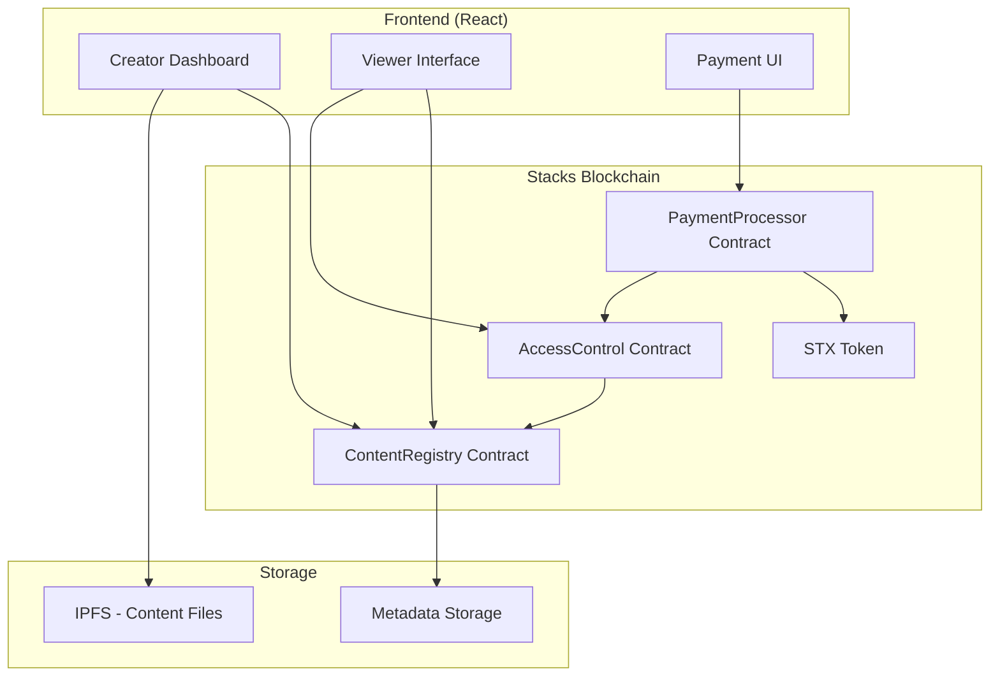

# BitStream Smart Contracts Design

## Overview

The BitStream smart contract system consists of three main contracts deployed on Stacks blockchain:

1. **ContentRegistry Contract** - Manages content NFTs and metadata
2. **PaymentProcessor Contract** - Handles STX payments and revenue distribution  
3. **AccessControl Contract** - Manages content access permissions

These contracts work together to provide a decentralized content monetization platform where creators can upload content, set prices, and automatically receive payments when viewers purchase access.

## Architecture



## Components and Interfaces

### 1. ContentRegistry Contract

**Purpose**: Manages content NFTs, metadata, and ownership

**Key Functions**:
```clarity
;; Register new content
(define-public (register-content 
    (content-hash (buff 32))
    (metadata-uri (string-ascii 256))
    (price uint)
    (creator principal))
    (response uint uint))

;; Update content metadata (owner only)
(define-public (update-content-metadata
    (content-id uint)
    (new-metadata-uri (string-ascii 256))
    (new-price uint))
    (response bool uint))

;; Get content information
(define-read-only (get-content-info (content-id uint))
    (optional {
        creator: principal,
        content-hash: (buff 32),
        metadata-uri: (string-ascii 256),
        price: uint,
        created-at: uint,
        updated-at: uint
    }))

;; Transfer content ownership
(define-public (transfer-content
    (content-id uint)
    (new-owner principal))
    (response bool uint))
```

**Data Structures**:
```clarity
;; Content information map
(define-map content-registry
    { content-id: uint }
    {
        creator: principal,
        content-hash: (buff 32),
        metadata-uri: (string-ascii 256),
        price: uint,
        created-at: uint,
        updated-at: uint,
        is-active: bool
    })

;; Content counter for unique IDs
(define-data-var content-id-counter uint u0)
```

### 2. PaymentProcessor Contract

**Purpose**: Handles STX payments and automatic revenue distribution

**Key Functions**:
```clarity
;; Process payment for content access
(define-public (purchase-content
    (content-id uint)
    (payment-amount uint))
    (response bool uint))

;; Withdraw creator earnings
(define-public (withdraw-earnings)
    (response uint uint))

;; Get creator earnings balance
(define-read-only (get-creator-earnings (creator principal))
    uint)

;; Admin function to update platform fee
(define-public (set-platform-fee (new-fee-percentage uint))
    (response bool uint))
```

**Revenue Distribution Logic**:
- 90% to content creator
- 10% to platform treasury
- Automatic distribution on each payment
- Creator earnings tracked separately for withdrawal

**Data Structures**:
```clarity
;; Creator earnings tracking
(define-map creator-earnings
    { creator: principal }
    { balance: uint })

;; Platform treasury balance
(define-data-var platform-treasury uint u0)

;; Platform fee percentage (basis points, e.g., 1000 = 10%)
(define-data-var platform-fee-percentage uint u1000)
```

### 3. AccessControl Contract

**Purpose**: Manages content access permissions and verification

**Key Functions**:
```clarity
;; Grant access to content (called by PaymentProcessor)
(define-public (grant-access
    (content-id uint)
    (viewer principal))
    (response bool uint))

;; Check if user has access to content
(define-read-only (has-access
    (content-id uint)
    (viewer principal))
    bool)

;; Revoke access (creator or admin only)
(define-public (revoke-access
    (content-id uint)
    (viewer principal))
    (response bool uint))

;; Get all content accessible by user
(define-read-only (get-user-content-access (viewer principal))
    (list 100 uint))
```

**Data Structures**:
```clarity
;; Access permissions mapping
(define-map content-access
    { content-id: uint, viewer: principal }
    {
        granted-at: uint,
        expires-at: (optional uint),
        is-active: bool
    })

;; User's accessible content list
(define-map user-content-list
    { viewer: principal }
    { content-ids: (list 100 uint) })
```

## Data Models

### Content Metadata Structure (stored off-chain)
```json
{
  "title": "Content Title",
  "description": "Content description",
  "contentType": "video|image|audio|document",
  "thumbnailUrl": "ipfs://...",
  "contentUrl": "ipfs://...",
  "duration": 3600,
  "tags": ["tag1", "tag2"],
  "createdAt": "2024-01-01T00:00:00Z",
  "fileSize": 1024000,
  "checksum": "sha256hash"
}
```

### Event Structures
```clarity
;; Content registered event
(define-data-var content-registered-event
    {
        content-id: uint,
        creator: principal,
        price: uint,
        metadata-uri: (string-ascii 256)
    })

;; Payment processed event
(define-data-var payment-processed-event
    {
        content-id: uint,
        viewer: principal,
        amount: uint,
        creator-share: uint,
        platform-share: uint
    })

;; Access granted event
(define-data-var access-granted-event
    {
        content-id: uint,
        viewer: principal,
        granted-at: uint
    })
```

## Error Handling

### Error Codes
```clarity
;; Content Registry Errors
(define-constant ERR-CONTENT-NOT-FOUND u1001)
(define-constant ERR-NOT-CONTENT-OWNER u1002)
(define-constant ERR-CONTENT-ALREADY-EXISTS u1003)
(define-constant ERR-INVALID-METADATA u1004)

;; Payment Processor Errors
(define-constant ERR-INSUFFICIENT-PAYMENT u2001)
(define-constant ERR-PAYMENT-FAILED u2002)
(define-constant ERR-NO-EARNINGS u2003)
(define-constant ERR-WITHDRAWAL-FAILED u2004)

;; Access Control Errors
(define-constant ERR-ACCESS-DENIED u3001)
(define-constant ERR-ACCESS-ALREADY-GRANTED u3002)
(define-constant ERR-ACCESS-NOT-FOUND u3003)

;; General Errors
(define-constant ERR-NOT-AUTHORIZED u4001)
(define-constant ERR-CONTRACT-PAUSED u4002)
(define-constant ERR-INVALID-INPUT u4003)
```

### Error Handling Strategy
- All public functions return `(response success-type error-type)`
- Detailed error codes for different failure scenarios
- Graceful handling of edge cases (e.g., failed transfers)
- Event emission for successful operations only

## Testing Strategy

### Unit Tests
1. **ContentRegistry Tests**
   - Content registration with valid/invalid data
   - Metadata updates by owner/non-owner
   - Content transfer functionality
   - Duplicate content prevention

2. **PaymentProcessor Tests**
   - Payment processing with correct/incorrect amounts
   - Revenue distribution calculations
   - Creator earnings withdrawal
   - Platform fee updates

3. **AccessControl Tests**
   - Access granting and verification
   - Access revocation by authorized parties
   - Batch access queries
   - Permission inheritance

### Integration Tests
1. **End-to-End Payment Flow**
   - Creator registers content → Viewer pays → Access granted → Revenue distributed
   - Multiple viewers purchasing same content
   - Creator withdrawing accumulated earnings

2. **Cross-Contract Communication**
   - PaymentProcessor calling AccessControl
   - AccessControl querying ContentRegistry
   - Event emission across contracts

3. **Frontend Integration**
   - Contract function calls from React app
   - Event listening and state updates
   - Error handling and user feedback

### Security Tests
1. **Access Control Validation**
   - Unauthorized function calls
   - Privilege escalation attempts
   - Input validation and sanitization

2. **Economic Attack Vectors**
   - Payment manipulation attempts
   - Revenue distribution exploits
   - Reentrancy attack prevention

3. **Admin Function Security**
   - Multi-signature requirements
   - Emergency pause functionality
   - Parameter update validations

## Deployment Strategy

### Contract Deployment Order
1. Deploy ContentRegistry contract first
2. Deploy AccessControl contract with ContentRegistry reference
3. Deploy PaymentProcessor contract with references to both
4. Initialize contracts with admin addresses and initial parameters

### Configuration Parameters
```clarity
;; Initial platform fee (10%)
(define-constant INITIAL-PLATFORM-FEE u1000)

;; Maximum content price (1000 STX)
(define-constant MAX-CONTENT-PRICE u1000000000)

;; Platform admin address
(define-constant PLATFORM-ADMIN 'SP2J6ZY48GV1EZ5V2V5RB9MP66SW86PYKKNRV9EJ7)

;; Treasury address for platform fees
(define-constant PLATFORM-TREASURY 'SP2J6ZY48GV1EZ5V2V5RB9MP66SW86PYKKNRV9EJ7)
```

### Upgrade Strategy
- Contracts are immutable once deployed
- New versions require redeployment and migration
- Data migration scripts for moving content and access records
- Gradual migration with dual-contract support period