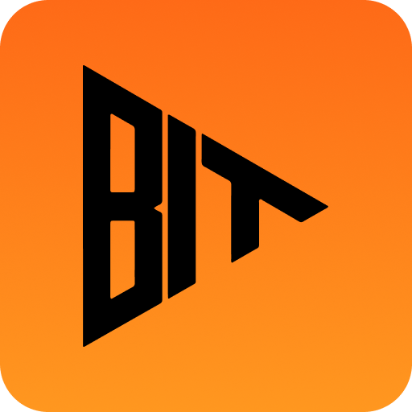

# BitStream 
[](https://opensource.org/licenses/MIT)
[](https://stacks.co)
[](https://leather.io)



> Bitcoin-native micropayment streaming platform for exclusive content creators

BitStream enables creators to monetize **exclusive content** in real-time through frictionless Bitcoin micropayments. Users stream tiny sBTC payments per second/minute of content consumed with **complete anonymity and privacy**—no crypto knowledge required. Creators receive **instant payments** with every second of content consumed.

## 🎯 Problem Statement

Traditional content monetization platforms suffer from:
- High payment processing fees (3-5%)
- Delayed payouts (weeks/months)
- Geographic restrictions
- Complex onboarding for creators and consumers
- No granular pay-per-second models
- **Privacy concerns**: Viewers' identities and viewing habits exposed
- **Security risks**: Payment data vulnerable to breaches
- **Creator safety**: Payment information tied to personal identity
- **Limited exclusive content**: No anonymous, secure payment infrastructure

## 💡 Solution

BitStream leverages **sBTC** on Stacks with **dual wallet options** to create a **privacy-first, secure micropayment experience** for exclusive content where:
- **Anonymous viewing**: Users consume content without revealing identity
- **Instant creator payments**: Real-time sBTC settlements per second of content
- **Flexible wallet options**: Choose between embedded wallets (Turnkey) or existing Stacks wallets (Leather/Xverse)
- **Secure payments**: Bitcoin-level security with smart contract automation
- Users pay only for what they consume (per-second streaming)
- **Easy onboarding**: Email/passkey signup OR connect existing wallet
- Perfect for exclusive content creators who value privacy and safety

## ✨ Key Features 

### For Users
- **Anonymous Access**: Watch exclusive content without revealing identity
- **Dual Wallet Options**: 
  - **Easy Mode**: Email/passkey signup with embedded Turnkey wallets
  - **Advanced Mode**: Connect existing Leather or Xverse wallets
- **Privacy-Protected Payments**: Transactions pseudonymous via Bitcoin
- **Automatic Micropayments**: Set-and-forget streaming payments while consuming content
- **One-Click Tipping**: Boost creators during live streams with instant sBTC tips
- **No Payment Data Storage**: Zero credit card or banking information required

### For Creators
- **Instant Payments**: Receive sBTC in real-time as content is consumed—no waiting periods
- **Protected Identity**: Create under pseudonym without exposing personal payment details
- **Flexible Rate Setting**: Configure per-minute or per-second rates
- **Real-Time Analytics**: Track earnings, viewer count, and engagement live (without viewer identities)
- **Instant Withdrawals**: Access your sBTC earnings immediately to any Bitcoin wallet
- **Multi-Content Support**: Podcasts, live streams, written content, video, exclusive material
- **No Chargebacks**: Bitcoin finality ensures payments are irreversible
- **Geographic Freedom**: Accept payments from anywhere without restrictions

### Technical Highlights
- **Smart Contract Streaming**: Clarity contracts handle automated micropayment releases
- **sBTC Programmability**: Demonstrates novel Bitcoin Layer 2 use cases
- **Stacks Wallet Integration**: Seamless connection with popular Stacks wallets
- **Full Transaction Lifecycle**: End-to-end sBTC streaming and settlement

## 🏗️ Architecture

```
┌─────────────────┐
│  React Client   │
│ Stacks Connect  │
└────────┬────────┘
         │
         ▼
┌─────────────────┐
│ Leather/Xverse  │
│  Stacks Wallet  │
└────────┬────────┘
         │
         ▼
┌─────────────────┐      ┌──────────────────┐
│   Smart         │◄────►│  Stacks Network  │
│   Contracts     │      │  (Clarity Smart  │
└─────────────────┘      │   Contracts)     │
                         └──────────────────┘
```

## 🛠️ Tech Stack

**Frontend**
- React 18
- TypeScript
- Tailwind CSS
- Stacks Connect
- @stacks/transactions

**Blockchain**
- Stacks Testnet/Mainnet
- sBTC (Bitcoin L2)
- Clarity Smart Contracts

**Wallet Options**
- **Turnkey Embedded Wallets** (Email/Passkey signup)
- **Leather Wallet** (Connect existing)
- **Xverse Wallet** (Connect existing)
- **Any Stacks-compatible wallet**

## 🚀 Getting Started

### Prerequisites

```bash
node >= 18.x
npm >= 9.x
```

### Installation

1. **Clone the repository**
```bash
git clone https://github.com/yourusername/bitstream.git
cd bitstream
```

2. **Install dependencies**

Frontend:
```bash
cd bitstream-web
npm install
```

Contracts:
```bash
cd bitstream-contracts
npm install
```

3. **Environment Setup**

Frontend (`bitstream-web/.env.development`):
```env
# Stacks Configuration
VITE_STACKS_NETWORK=testnet
VITE_STACKS_API_URL=https://api.testnet.hiro.so

# Contract Addresses (Testnet)
VITE_CONTRACT_CONTENT_REGISTRY=SP2AJZZ6JAGEXV7SX056F9EZFABTX64CM2CQTPCCX.content-registry
VITE_CONTRACT_ACCESS_CONTROL=SP2AJZZ6JAGEXV7SX056F9EZFABTX64CM2CQTPCCX.access-control
VITE_CONTRACT_PAYMENT_PROCESSOR=SP2AJZZ6JAGEXV7SX056F9EZFABTX64CM2CQTPCCX.payment-processor

# Feature Flags
VITE_DEMO_MODE=false
VITE_ENABLE_FAUCET=true
```

4. **Deploy Smart Contracts** (Optional - already deployed to testnet)
```bash
cd bitstream-contracts
node deploy-simple.cjs
```

5. **Start Development Server**
```bash
cd bitstream-web
npm run dev
```

Visit `http://localhost:5173`

## 📁 Project Structure

```
bitstream/
├── bitstream-web/          # React frontend
│   ├── src/
│   │   ├── components/     # React components
│   │   ├── pages/          # Page components
│   │   ├── contexts/       # React context providers
│   │   │   └── StacksWalletContext.tsx # Stacks wallet integration
│   │   ├── lib/            # Utility libraries
│   │   │   └── contracts/  # Smart contract interactions
│   │   ├── config/         # Configuration files
│   │   └── App.tsx         # Root component
│   └── package.json
│
├── bitstream-contracts/    # Clarity smart contracts
│   ├── contracts/          # Contract source files
│   │   ├── content-registry.clar    # Content management
│   │   ├── access-control.clar      # Access permissions
│   │   └── payment-processor.clar   # Payment processing
│   ├── deploy-simple.cjs   # Deployment script
│   └── DEPLOYMENT.md       # Deployment guide
│
└── .kiro/                  # Development specifications
    └── specs/              # Project specifications
```

## 🎮 Usage

### Setup Your Wallet

**Option 1: Turnkey Embedded Wallet (Recommended for beginners)**
1. **Sign Up**: Use email and passkey to create account
2. **Instant Wallet**: Wallet created automatically
3. **Get Testnet STX**: Use built-in faucet feature

**Option 2: Existing Stacks Wallet (Advanced users)**
1. **Install Leather Wallet**: Download from [leather.io](https://leather.io)
2. **Create/Import Wallet**: Set up your Stacks wallet
3. **Get Testnet STX**: Visit [Stacks Testnet Faucet](https://explorer.hiro.so/sandbox/faucet?chain=testnet)

### As a Consumer

1. **Connect Wallet**: Click "Connect Stacks Wallet" and approve in Leather
2. **Browse Content**: Discover creators and content
3. **Start Streaming**: Click play—micropayments stream automatically via wallet
4. **Tip Creators**: Send one-click sBTC boosts during live content

### As a Creator

1. **Connect Wallet**: Link your Stacks wallet to create profile
2. **Upload Content**: Add podcasts, videos, or livestream
3. **Set Your Rate**: Configure per-minute sBTC pricing
4. **Go Live**: Start earning as users consume your content
5. **Withdraw**: Instant sBTC withdrawal to your wallet

## 📝 Smart Contract Interfaces

### Content Registry Contract

```clarity
;; Register new content
(define-public (register-content 
    (content-hash (buff 32))
    (metadata-uri (string-ascii 256))
    (price uint)
    (creator principal))
    ;; Implementation
)

;; Get content information
(define-read-only (get-content-info 
    (content-id uint))
    ;; Implementation
)
```

### Payment Processor Contract

```clarity
;; Purchase content access
(define-public (purchase-content 
    (content-id uint)
    (payment-amount uint))
    ;; Implementation
)

;; Withdraw creator earnings
(define-public (withdraw-earnings)
    ;; Implementation
)
```

### Access Control Contract

```clarity
;; Check if user has access
(define-read-only (has-access 
    (content-id uint)
    (viewer principal))
    ;; Implementation
)

;; Grant access to content
(define-public (grant-access
    (content-id uint)
    (viewer principal))
    ;; Implementation
)
```

## 🔐 Security Considerations

**Privacy & Anonymity**
- **Wallet-Based Identity**: Users identified only by Stacks addresses
- **Minimal Data Collection**: No personal information required
- **Pseudonymous Transactions**: Payments via Bitcoin addresses
- **No Viewing History Tracking**: Content consumption not linked to real identities

**Payment Security**
- **Non-Custodial Wallets**: Users control their own keys via Leather/Xverse
- **Smart Contract Automation**: Reduces human error and fraud vectors
- **Instant Settlement**: Bitcoin finality prevents chargebacks
- **Multi-Signature Options**: Available for high-value creator accounts

**Platform Security**
- **Smart Contract Verification**: All contracts deployed and verified on Stacks
- **Open Source**: Full transparency of contract code
- **Wallet Security**: Leverages battle-tested Stacks wallet infrastructure
- **No Private Key Storage**: Platform never handles user private keys

## 🧪 Testing

### Test Smart Contracts

Visit the test page at `/test-contracts` to:
- Connect your Stacks wallet
- Test contract interactions
- Verify deployment status
- Send test transactions

```bash
# Run frontend tests
cd bitstream-web
npm test

# Test contract deployment
cd bitstream-contracts
npm test
```

## 🌐 Deployed Contracts (Testnet)

| Contract | Address |
|----------|---------|
| **Content Registry** | `SP2AJZZ6JAGEXV7SX056F9EZFABTX64CM2CQTPCCX.content-registry` |
| **Access Control** | `SP2AJZZ6JAGEXV7SX056F9EZFABTX64CM2CQTPCCX.access-control` |
| **Payment Processor** | `SP2AJZZ6JAGEXV7SX056F9EZFABTX64CM2CQTPCCX.payment-processor` |

## 🗺️ Roadmap

**MVP (Current)**
- [x] Stacks wallet integration (Leather, Xverse)
- [x] Smart contract deployment on testnet
- [x] Basic content registry and payment processing
- [x] Creator dashboard
- [x] Consumer content player

**Phase 2**
- [ ] Mainnet launch
- [ ] Advanced streaming payment mechanics
- [ ] Content recommendation engine
- [ ] Mobile responsive optimization
- [ ] Multi-tier subscription options

**Phase 3**
- [ ] Mobile apps with wallet integration
- [ ] Creator NFT badges
- [ ] Decentralized content storage (IPFS)
- [ ] Cross-chain support
- [ ] Advanced analytics dashboard

## 🤝 Contributing

Contributions are welcome! Please read our [Contributing Guide](CONTRIBUTING.md) for details.

1. Fork the repository
2. Create your feature branch (`git checkout -b feature/AmazingFeature`)
3. Commit your changes (`git commit -m 'Add some AmazingFeature'`)
4. Push to the branch (`git push origin feature/AmazingFeature`)
5. Open a Pull Request

## 📄 License

This project is licensed under the MIT License - see the [LICENSE](LICENSE) file for details.

## 🙏 Acknowledgments

- [Stacks Foundation](https://stacks.org) for sBTC infrastructure
- [Leather Wallet](https://leather.io) for excellent Stacks wallet UX
- [Xverse](https://xverse.app) for multi-chain wallet support
- Bitcoin community for continuous innovation

**Built with ⚡ for the Stacks ecosystem**